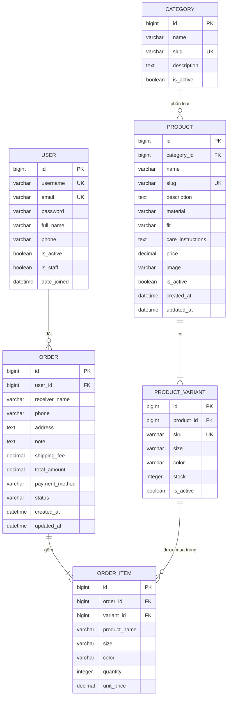

# ERD hệ thống Nexus

Mô hình dữ liệu đề xuất cho website thời trang nam Nexus, gồm suit, blazer, sơ mi và quần. Sản phẩm có biến thể theo kích thước và màu sắc để quản lý tồn kho và đặt hàng chính xác.

Đây là thiết kế cho backend Django/MySQL, chưa phải mô hình đã triển khai trong `core/models.py`. Các trường trong sơ đồ là trường nghiệp vụ chính, không liệt kê toàn bộ trường có sẵn của Django User.

## Quan hệ giữa các model

| Quan hệ | Ý nghĩa |
|---|---|
| `User 1 — N Order` | Một người dùng có thể đặt nhiều đơn hàng. |
| `Category 1 — N Product` | Một danh mục chứa nhiều sản phẩm. |
| `Order 1 — N OrderItem` | Một đơn hàng có ít nhất một dòng sản phẩm. |
| `Product 1 — N ProductVariant` | Một sản phẩm có các biến thể size/màu, ví dụ suit Navy Roma, size 48, màu navy. |
| `ProductVariant 1 — N OrderItem` | Một biến thể có thể xuất hiện trong nhiều đơn hàng. |

`Order` và `ProductVariant` có quan hệ nhiều–nhiều thông qua `OrderItem`. Mỗi dòng đơn hàng xác định đúng size/màu khách mua, lưu số lượng, đơn giá và bản sao tên sản phẩm, size, màu tại thời điểm đặt hàng.

## Thông tin sản phẩm thời trang

- `Category`: danh mục như suit, blazer, sơ mi và quần.
- `Product.material`: chất liệu, ví dụ wool blend, cotton hoặc linen.
- `Product.fit`: phom dáng, ví dụ regular tailored hoặc relaxed fit.
- `Product.care_instructions`: hướng dẫn giặt, bảo quản và chăm sóc.
- `ProductVariant.size`: chuỗi như `S`, `M`, `L`, `48`, `50`; chỉ lưu những size thực sự bán, không dùng khoảng `46–54` cho một biến thể.
- `ProductVariant.color`: màu của biến thể. Cặp size/màu xác định một lựa chọn mua hàng trong cùng sản phẩm.
- `Product.price` và `Product.image` dùng chung cho các biến thể trong bản đơn giản. Nếu cần giá hoặc ảnh riêng theo biến thể, có thể mở rộng sau.

## Quy tắc dữ liệu chính

- `username`, `email`, `Category.slug` và `Product.slug` không được trùng.
- `Product.price` phải lớn hơn `0`.
- `ProductVariant.sku` không được trùng; tổ hợp `(product, size, color)` phải duy nhất.
- `ProductVariant.stock` không được âm; tồn kho quản lý ở biến thể, không lưu thêm một tổng tồn kho độc lập trên `Product`.
- Sản phẩm được mở bán phải có ít nhất một biến thể hoạt động. Không cho đặt sản phẩm hoặc biến thể đã ngừng bán.
- Giỏ hàng lưu `variant_id` và số lượng, để cùng một sản phẩm khác size/màu là các dòng riêng biệt.
- `OrderItem.quantity` phải lớn hơn `0`.
- `OrderItem.unit_price` phải lớn hơn `0`, lưu giá tại thời điểm đặt hàng, không phụ thuộc vào giá sản phẩm thay đổi sau đó.
- Backend sao chép `product_name`, `size`, `color` vào `OrderItem` khi tạo đơn; không cập nhật các bản sao này khi sửa catalog.
- `Order.shipping_fee` không âm. Backend tính `Order.total_amount = tổng(quantity × unit_price) + shipping_fee`, không lấy tổng tiền hoặc đơn giá do giao diện gửi lên.
- Khi tạo đơn, backend kiểm tra và trừ tồn kho trong cùng giao dịch để tránh bán vượt số lượng. Khi hủy đơn đã trừ kho, hoàn lại đúng số lượng một lần.
- Sản phẩm và biến thể đã từng xuất hiện trong đơn hàng nên chuyển `is_active=False` thay vì xóa cứng.
- `Order.status` có thể gồm: `pending`, `confirmed`, `shipping`, `completed`, `cancelled`.
- `Order.payment_method` ở phiên bản đơn giản có thể chỉ dùng `cod`.
- Thiết kế này yêu cầu đăng nhập để đặt hàng (`Order.user` bắt buộc). Thông tin người nhận lưu trên đơn để lịch sử không đổi khi khách sửa hồ sơ.

## Ánh xạ sang Django

- `USER`: dùng `django.contrib.auth` hoặc custom user kế thừa `AbstractUser`.
- `Product.category`: `ForeignKey(Category, on_delete=models.PROTECT)`.
- `ProductVariant.product`: `ForeignKey(Product, on_delete=models.PROTECT)`.
- `Order.user`: `ForeignKey(User, on_delete=models.PROTECT)`.
- `OrderItem.order`: `ForeignKey(Order, on_delete=models.CASCADE)`.
- `OrderItem.variant`: `ForeignKey(ProductVariant, on_delete=models.PROTECT)`.
- Dùng `UniqueConstraint` cho `(product, size, color)` trong `ProductVariant` và `(order, variant)` trong `OrderItem`.
- Dùng `DecimalField` cho tiền và `CheckConstraint` cho giá, số lượng, tồn kho, phí vận chuyển theo các quy tắc trên.
- Lưu mật khẩu qua cơ chế băm của Django, không lưu văn bản thuần. Nếu bắt buộc email duy nhất, cần custom user hoặc ràng buộc tương ứng; User mặc định không bảo đảm điều này.
- Việc đơn hàng có ít nhất một dòng và sản phẩm mở bán có biến thể phải được kiểm tra ở luồng nghiệp vụ; riêng khóa ngoại không bảo đảm được.

## Phạm vi chưa đưa vào bản đơn giản

Các model sau có thể bổ sung sau khi CRUD và luồng đặt hàng cơ bản hoạt động ổn định:

- `ProductImage`: nhiều ảnh cho một sản phẩm.
- `Brand`: quản lý thương hiệu thời trang nếu cửa hàng bán nhiều thương hiệu.
- `Address`: lưu nhiều địa chỉ của khách hàng.
- `Payment`: theo dõi giao dịch thanh toán riêng.
- `SizeGuide`: bảng số đo và hướng dẫn chọn size theo danh mục.

Không đưa `Wishlist` và `Coupon` vào phạm vi hiện tại vì giao diện đã bỏ các chức năng này. Giỏ hàng có thể lưu trong session; hóa đơn lấy từ `Order` và `OrderItem`, chưa cần bảng riêng.
